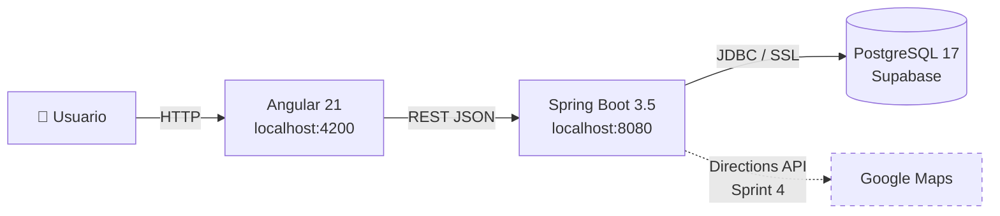
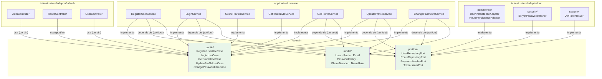
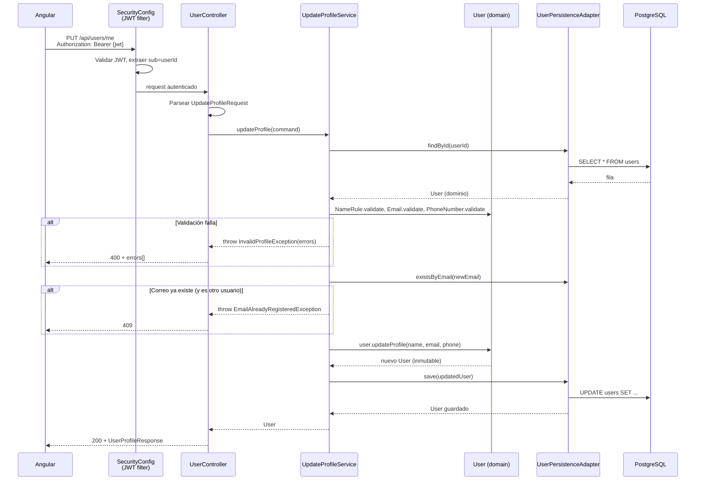

# FusaRoute Backend

API REST para el sistema de información de transporte público de Fusagasugá.
Arquitectura hexagonal (puertos y adaptadores), Java 25, Spring Boot 3.5, PostgreSQL en Supabase.

## Cómo correr

**Requisitos:** JDK 25 y Maven 3.9+. No requiere PostgreSQL local — DEV apunta al
proyecto Supabase compartido `fusaroute-dev`.

```bash
cp .env.example .env
# Llenar .env con las credenciales (ver .env.example para cada variable).
# JWT_SECRET es obligatorio: genéralo con  openssl rand -base64 32
# CORS_ALLOWED_ORIGINS: dejar COMENTADA si usas el default (localhost:4200,8081).
#   Una línea presente pero vacía rompe CORS.
mvn spring-boot:run -Dspring-boot.run.profiles=dev
# Comprobar: GET http://localhost:8080/health  →  {"status":"UP"}
```

## Arquitectura

### Contexto general



### Hexágono: capas y su mapeo al código



> La dependencia siempre apunta hacia adentro: `domain` no importa Spring, JPA ni Jackson.
> ArchUnit lo verifica en cada build.

### Secuencia: PUT /api/users/me (actualizar perfil)



## API

### Tabla de endpoints

| Método | Ruta | Auth | Código(s) | Descripción |
|--------|------|------|-----------|-------------|
| `GET` | `/health` | No | 200 | Estado del servicio |
| `POST` | `/api/auth/register` | No | 201 / 400 / 409 | Registro de usuario |
| `POST` | `/api/auth/login` | No | 200 / 401 | Inicio de sesión (JWT) |
| `GET` | `/api/routes` | No | 200 | Catálogo de rutas activas |
| `GET` | `/api/routes/{id}` | No | 200 / 404 | Detalle de una ruta |
| `GET` | `/api/users/me` | Sí | 200 / 401 | Perfil del usuario autenticado |
| `PUT` | `/api/users/me` | Sí | 200 / 400 / 401 / 409 | Actualizar perfil |
| `PUT` | `/api/users/me/password` | Sí | 204 / 400 / 401 | Cambiar contraseña |

### Contrato de error (ProblemDetail, RFC 9457)

Todos los errores devuelven un cuerpo JSON con al menos `status` y `detail`:

```json
{ "type": "about:blank", "title": "Bad Request", "status": 400, "detail": "Datos de registro invalidos",
  "errors": [{ "field": "password", "message": "La contrasena debe incluir al menos un numero" }] }
```

- `errors` solo aparece en `400` de validación (registro, perfil, contraseña).
- `401` sin token o con token inválido: `detail` = "Autenticacion requerida".
- `401` en login: `detail` = "Correo o contrasena incorrectos".
- `409`: `detail` = "Ya existe una cuenta con ese correo".
- `404`: `detail` = "Ruta no encontrada" / "El usuario no fue encontrado".
- `415`, `405`: el código HTTP correcto (no 500), con `detail` descriptivo.

### `POST /api/auth/register` — Registro de usuario (RF-01, SCRUM-12)

Endpoint público (no requiere token). Crea un usuario con rol `USER`, activado de
inmediato (sin verificación por correo este semestre).

**Request** (`application/json`):

```json
{ "name": "Ana Pérez", "email": "ana@ejemplo.com", "password": "Clave123" }
```

- `name`: obligatorio, máximo 120 caracteres.
- `email`: obligatorio, formato válido, único; se normaliza (trim + minúsculas).
- `password`: mínimo 8 caracteres, al menos 1 mayúscula y 1 número, máximo 72 bytes UTF-8.
- El teléfono no se envía en el registro; se edita luego en el perfil (RF-03).

**`201 Created`** — nunca incluye el hash de la contraseña:

```json
{ "id": 1, "name": "Ana Pérez", "email": "ana@ejemplo.com", "role": "USER", "active": true }
```

**Errores** (cuerpo `ProblemDetail`, RFC 9457):

- **`400`** validación. Reúne todos los incumplimientos en la propiedad `errors`:

  ```json
  { "status": 400, "detail": "Datos de registro invalidos",
    "errors": [ { "field": "password", "message": "La contrasena debe incluir al menos un numero" } ] }
  ```

  Un JSON malformado también da `400`, con `detail` genérico y sin `errors`.

- **`409`** el correo ya tiene cuenta: `detail` = "Ya existe una cuenta con ese correo".

### `POST /api/auth/login` — Inicio de sesión (RF-02, SCRUM-13)

Endpoint público (no requiere token). Autentica con correo y contraseña y emite un
JWT (HS256) con validez de **una semana** (RNF-04); vencido, el usuario vuelve a
loguearse.

**Request** (`application/json`):

```json
{ "email": "ana@ejemplo.com", "password": "Clave123" }
```

El correo se normaliza (trim + minúsculas) igual que en el registro.

**`200 OK`** — nunca incluye el hash de la contraseña:

```json
{ "token": "eyJhbGciOi...", "tokenType": "Bearer", "expiresAt": "2026-10-05T12:00:00Z",
  "user": { "id": 1, "name": "Ana Pérez", "email": "ana@ejemplo.com", "role": "USER", "active": true } }
```

El token lleva el id del usuario en `sub` y el rol en `role`. El frontend lo guarda y lo
envía en cada petición autenticada:

```
Authorization: Bearer eyJhbGciOi...
```

**Errores** (cuerpo `ProblemDetail`, RFC 9457):

- **`401`** credenciales incorrectas: `detail` = "Correo o contrasena incorrectos". Es el
  **mismo mensaje** para correo inexistente, contraseña incorrecta, cuenta inactiva y
  formato de correo inválido, para no revelar qué correos tienen cuenta.

Cualquier otro endpoint (salvo `/health`, el registro, el login y el catálogo público de
rutas) responde **`401`** sin token, o con un token inválido o vencido.

Fuera de este sprint: el contador de intentos fallidos y el bloqueo temporal (SCRUM-155,
Sprint 3), y no hay logout ni revocación: un token es válido hasta que vence.

**Configuración:** requiere la variable `JWT_SECRET` (Base64, mínimo 32 bytes decodificados);
sin ella, o si es débil, la aplicación no arranca. Genérala con `openssl rand -base64 32`.

### `GET /api/routes` y `GET /api/routes/{id}` — Catálogo público de rutas (RF-15, SCRUM-19)

Endpoints públicos (sin token ni sesión), de solo lectura. Cualquier otro método sobre
`/api/routes` sigue exigiendo autenticación.

**`GET /api/routes`** — `200 OK`. Solo rutas **activas** (las suspendidas no aparecen),
ordenadas por nombre. Sin rutas activas devuelve `[]`.

**`GET /api/routes/{id}`** — `200 OK` con una sola ruta, del mismo formato.

```json
{
  "id": 8,
  "name": "Fusagasugá - Pasca",
  "type": "INTERMUNICIPAL",
  "neighborhoods": ["Fusagasugá", "Corregimiento", "Alaska", "Pasca"],
  "fares": [
    { "referencePoint": "Alaska", "amount": 3550.00, "validFrom": "2026-02-05" },
    { "referencePoint": "Pasca", "amount": 4300.00, "validFrom": "2025-01-16" }
  ]
}
```

- `type`: `URBANA` o `INTERMUNICIPAL`.
- `neighborhoods`: barrios en orden de recorrido. Son nombres, no paradas: en Fusagasugá se
  para la buseta con la mano.
- `fares`: solo las tarifas **vigentes**. Por cada `referencePoint` se toma la fila con el
  `validFrom` más reciente que no sea futuro; una tarifa anunciada para después de hoy no
  aparece todavía. Van de menor a mayor `amount`.
  - Ruta urbana: una sola tarifa con `referencePoint: null`.
  - Ruta intermunicipal: una tarifa por punto de referencia de bajada.
  - `validFrom` es la fecha de la última actualización de ese precio; puede ser de años
    distintos dentro de una misma ruta (ver V3).
- "Hoy" se calcula en la zona `America/Bogota`.

**Errores** (cuerpo `ProblemDetail`, RFC 9457):

- **`404`** la ruta no existe **o está suspendida** (`detail` = "Ruta no encontrada"): el
  catálogo público no revela que existe una ruta suspendida.
- **`400`** el `id` no es numérico (`/api/routes/abc`).
